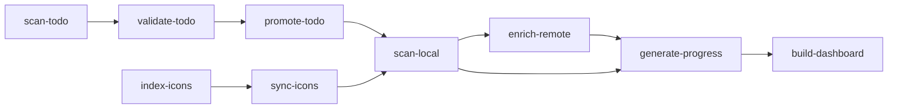

# 🧰 Medix – Personal Media Tracker

**Medix** is a personal static-site generator and thumbnailing tracker designed to assist with **custom `.ico` icon management** for folders in **Windows Explorer**.

It helps manage `.ico` files, `desktop.ini`, and genre-based folder organization for movie and TV show collections.

## 🎯 Purpose
This tool is built for **personal development and usage**, focusing on:

- Tracking folders with assigned `.ico` and `desktop.ini`
- Organizing movies and TV shows by genre and collection
- Visualizing thumbnailing progress (RAW → PNG → ICO)
- Generating a clean static HTML dashboard for quick review
- Automating deployment to GitHub Pages (for private access)

## ⚙️ How It Works
- Scans directories like `Media/Movies/<Genre>/<Title>` to detect `.ico` and `desktop.ini` presence
- Outputs data into JSON files (`progress.json`, `movies.json`)
- Builds a static dashboard using Go templates and JavaScript
- Supports collapsible genre and collection views
- Offers responsive layout: card-based on mobile, table-based on desktop

## 🏗️ Project Structure
```
medix/
├── cmd/ # CLI tools: scanner, builder
├── data/ # Generated JSON files
├── dist/ # Final static site (HTML, CSS, JS)
├── public/ # Assets (style.css, script.js)
├── templates/ # HTML templates (Go templating)
├── Makefile # Build automation commands
├── deploy.sh # Deployment script for GitHub Pages
├── .air.toml # Air live-reload config
└── README.md
```

---

## 🗂️ Project Modules

| Module Name         | Description |
| ------------------- | ----------- |
| `scan-local`        | Scans `Media/Movies` to detect existing `.ico`, `desktop.ini`, and folder structure |
| `enrich-remote`     | *(Optional)* Adds metadata using TMDb or other sources |
| `generate-progress` | Generates `progress.json` summary from `movies.json` |
| `sync-icons`        | Syncs icons from `icons/personal` and `icons/downloaded` into movie folders |
| `index-icons`       | Indexes `.ico` files into `icons.index.json` for fast access |
| `scan-todo`         | Parses and normalizes unprocessed files in `TODO/` |
| `validate-todo`     | Flags files missing icon, year, or genre |
| `promote-todo`      | Moves validated items to `Media/Movies/<Genre>/Movie Name (Year)/` |
| `build-dashboard`   | Builds static site from `movies.json`, `progress.json`, and templates |

### 📁 Key Directories

| Path                | Purpose |
| ------------------- | ------- |
| `Media/Movies/`     | Final organized movies by genre |
| `TODO/`             | Temporary holding area for unprocessed media |
| `icons/personal/`   | Handcrafted `.ico` files |
| `icons/downloaded/` | Scraped or bulk `.ico` files |
| `data/`             | Generated JSON files (`movies.json`, etc.) |
| `templates/`        | Go templates for static HTML dashboard |
| `dist/`             | Final static site HTML output |


### 🧱 JSON File Outputs

| File               | Source              | Description |
| ------------------ | ------------------- | ----------- |
| `movies.raw.json`  | `scan-local`        | Base info from file system only |
| `movies.json`      | `enrich-remote`     | Enriched with external metadata |
| `progress.json`    | `generate-progress` | Thumbnail and status breakdown |
| `icons.index.json` | `index-icons`       | Fast reference of `.ico` locations |
| `todo.json`        | `scan-todo`         | Unprocessed media + metadata |

---

## 🔄 Data Flow



### ✅ TODO Workflow Stages
`scan-todo` → Parse all files/folders in TODO/

`validate-todo` → Check for icon, genre, year, and valid folder naming

`promote-todo` → Move valid items to Media/Movies/<Genre>/<Movie (Year)>

---

## 📦 Setup
#### 🛠 Requirements
- Go 1.21+
- Air for live-reloading (go install github.com/cosmtrek/air@latest)
- Bash + Git (for deployment)

### 🚀 Commands
```
make build         # Run Go builder to generate HTML and JSON data
make serve         # Serve /dist locally for preview
make watch         # Watch builder changes using Air
./deploy.sh        # Deploy to GitHub Pages (gh-pages branch)
```

### 📸 Features
- ✅ Visual progress bars for thumbnailing status
- 🎬 Genre and collection grouping with collapsible views
- 📱 Responsive UI: card view (mobile), table view (desktop)
- 🧪 No database – powered by filesystem and JSON only
- 🖼️ Emoji-based genre icons for easy recognition

## 🔒 Disclaimer
Medix is a personal-use tool intended for individual workflows.
Feel free to explore or adapt it to your needs, but it’s not built for general-purpose use or wide compatibility.

## 📄 License
This project is licensed under the [MIT License](LICENSE).  
You are free to use, modify, and distribute it with proper attribution.
