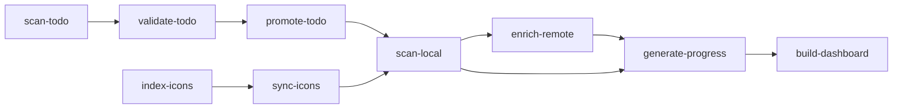

# 🧰 Medix – Personal Media Tracker

**Medix** is a personal static-site generator and thumbnailing tracker designed to assist with **custom `.ico` icon management** for folders in **Windows Explorer**.

It helps manage `.ico` files, `desktop.ini`, and genre-based folder organization for movie and TV show collections.

## 🎯 Purpose
This tool is built for **personal development and usage**, focusing on:

- Tracking folders with assigned `.ico` and `desktop.ini`
- Organizing movies and TV shows by genre and collection
- Visualizing thumbnailing progress (RAW → PNG → ICO)
- Generating a clean static HTML dashboard for quick review
- Automating deployment to GitHub Pages (for private access)

## ⚙️ How It Works
- Scans directories like `Media/Movies/<Genre>/<Title>` to detect `.ico` and `desktop.ini` presence
- Outputs data into JSON files (`progress.json`, `movies.json`)
- Builds a static dashboard using Go templates and JavaScript
- Supports collapsible genre and collection views
- Offers responsive layout: card-based on mobile, table-based on desktop

## 🏗️ Project Structure

<details>
<summary>Click to expand</summary>

    medix/
    ├── cmd/             # CLI tools: scanner, builder, watcher, etc.
    ├── data/            # Generated JSON files
    ├── dist/            # Final static site
    ├── public/          # Static assets
    ├── templates/       # Go HTML templates
    ├── scripts/         # Deploy scripts
    ├── Makefile         # Build automation
    ├── .air.toml        # Air config
    └── README.md        # Documentation

</details>

### 🗂️ Project Modules
| Module Name         | Description |
|---------------------|-------------|
| `scan-local`        | Scans `Media/Movies` to detect `.ico`, `desktop.ini`, and folder structure |
| `enrich-remote`     | *(Optional)* Enriches media with metadata (e.g. from TMDb) |
| `generate-progress` | Generates `progress.json` based on thumbnail status |
| `sync-icons`        | Syncs icons from `icons/personal` and `icons/downloaded` into movie folders |
| `index-icons`       | Indexes all `.ico` files into `icons.index.json` for fast lookup |
| `scan-todo`         | Parses and normalizes unprocessed files in `TODO/` |
| `validate-todo`     | Flags files missing icons, genres, or release years |
| `promote-todo`      | Moves validated items to `Media/Movies/<Genre>/Movie Name (Year)/` |
| `build-dashboard`   | Renders the static site from JSON data and templates |

### 📁 Key Directories

| Path                | Purpose |
|---------------------|---------|
| `Media/Movies/`     | Final organized movie folders by genre |
| `TODO/`             | Temporary storage for unprocessed media |
| `icons/personal/`   | Handcrafted `.ico` files |
| `icons/downloaded/` | Scraped or bulk `.ico` files |
| `data/`             | JSON output files (`movies.json`, etc.) |
| `templates/`        | Go HTML templates |
| `dist/`             | Final static site output |

### 🧱 JSON File Outputs

| File               | Source              | Description |
|--------------------|---------------------|-------------|
| `movies.raw.json`  | `scan-local`        | Basic info from folder structure |
| `movies.json`      | `enrich-remote`     | Enriched with external metadata |
| `progress.json`    | `generate-progress` | Tracks thumbnail status |
| `icons.index.json` | `index-icons`       | Index of all available `.ico` files |
| `todo.json`        | `scan-todo`         | Normalized data for unprocessed media |

## 🔄 Data Flow



## ✅ TODO Workflow Stages

1. `scan-todo` → Parse all media files/folders in `TODO/`
2. `validate-todo` → Check for icon, genre, year, and proper folder naming
3. `promote-todo` → Move valid entries to `Media/Movies/<Genre>/<Movie (Year)>`

## 📦 Setup
### 🛠 Requirements

- Go 1.21+
- [Air](https://github.com/cosmtrek/air) for live-reloading  
  `go install github.com/cosmtrek/air@latest`
- Bash and Git (for deployment script)

### 🚀 Commands
```bash
make build         # Build JSON and HTML output
make serve         # Serve /dist locally
make watch         # Auto-rebuild on changes with Air
./deploy.sh        # Deploy static site to gh-pages
```

## 📸 Features
- ✅ Visual progress bars for thumbnailing status
- 🎬 Genre and collection grouping with collapsible views
- 📱 Responsive UI: card view (mobile), table view (desktop)
- 🧪 No database – powered by filesystem and JSON only
- 🖼️ Emoji-based genre icons for easy recognition

## 🔒 Disclaimer
Medix is a personal-use tool intended for individual workflows.
Feel free to explore or adapt it to your needs, but it’s not built for general-purpose use or wide compatibility.

## 📄 License
This project is licensed under the [MIT License](LICENSE).  
You are free to use, modify, and distribute it with proper attribution.
